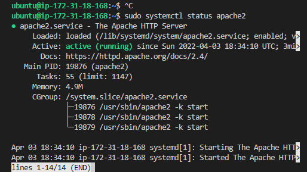
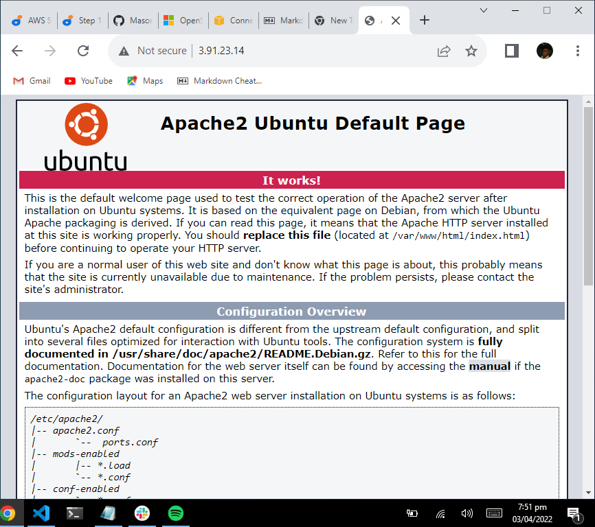
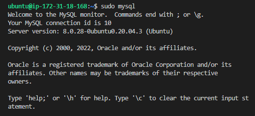
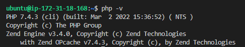
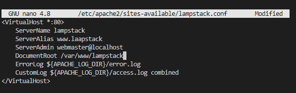
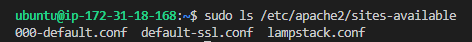
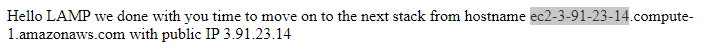

# STEP 1 — INSTALLING APACHE AND UPDATING THE FIREWALL
## INSTALL APACHE USING APT
### update a list of packages in package manager `sudo apt update && sudo apt upgrade`
### install apache2 using `sudo apt install apache2`
### verify apache2 is runnig ` sudo systemctl status apache2`

### let our Apache HTTP server on port 80 using ` curl http://127.0.0.1:80`
### test how our Apache HTTP server can respond to requests on the internet by running [Apache server](http:3.91.23.14:80) on any web server

# STEP 2 - INSTALLING MYSQL AND PHP
## INSTALLING MYSQL
### Install MySQL server using the code `sudo apt install mysql-server`
### set up password for MySQL server and remove some insecure default settings `sudo mysql_secure_installation`
### after setting up a password log in to MySQL using `sudo mysql`

## INSTALLING PHP
### We need to install PHP as a component of our set up that will proceess code to display dynamoic content to the end user.  In addition to the php package, we will download php-mysql and libapache2-mod-php.

### To install these 3 packages at once we use `sudo apt install php libapache2-mod-php php-mysql`
### check php version with `php -v`

# STEP 4 - CREATING A VIRTUAL HOST FOR YOUR WEBSITE USING APACHE
### create the directory for lampstack using `sudo mkdir /var/www/lampstack`
### Next using chown assign ownership of the directory with your current system user replace username with appropriate username
` sudo chown -R $USER:$USER /var/www/lampstack`
### using nano create and open a new configuration file in Apache's sites-available directory
`sudo nano /etc/apache2/sites-available/lampstack.conf`

### confirm your new file lampstack.conf has been created in the sites-available directory using `sudo ls /etc/apache2/sites-available`

### enable virtual host using a2ensite command `sudo a2ensite lampstack`
### disable apache default website using `sudo a2dissite 000-default`
### check for errors `sudo apache2ctl configtest`
### then finally reload Apache so these changes take effect using `sudi systemctl reload apache2`
## The website is now active, but it is still empty therefore we create an index.html file in the location so that we can test that the virtual host woeks as expected:
`sudo echo 'Hello LAMP we done with you time to move on to the next stack from hostname' $(curl -s http://169.254.169.254/latest/meta-data/public-hostname) 'with public IP' $(curl -s http://169.254.169.254/latest/meta-data/public-ipv4) > /var/www/lampstack/index.html`
### Now we can open our website url with our browser using IP address:  or [DNS](www.ec2-3-91-23-14.compute-1.amazonaws.com)

